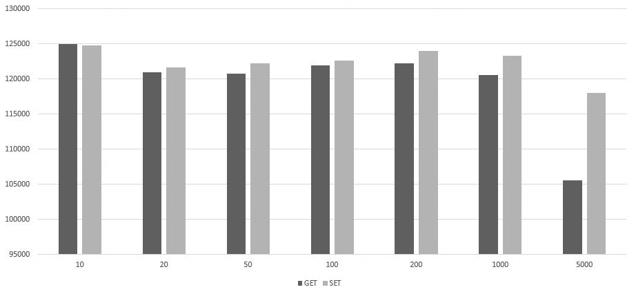

* OS: Window10
* CPU: i7-9700 @ 3.00GHz
* RAM: 16GB
* Redis Vesion: 5.0.13

采用单线程版本的Redis进行性能测试，结果如同所示。

可以看出，由于是单线程的缘故，如果一次操作的value较大时，会对整个Redis的处理速度造成影响。


```bash
redis-benchmark -t get,set -n 1000000 -d 10 -q
SET: 124812.78 requests per second
GET: 124937.54 requests per second
```

```bash
redis-benchmark -t get,set -n 1000000 -d 20 -q
SET: 121639.71 requests per second
GET: 120918.98 requests per second
```

```bash
redis-benchmark -t get,set -n 1000000 -d 50 -q
SET: 122249.38 requests per second
GET: 120758.36 requests per second
```

```bash
redis-benchmark -t get,set -n 1000000 -d 100 -q
SET: 122579.06 requests per second
GET: 121921.48 requests per second
```

```bash
redis-benchmark -t get,set -n 1000000 -d 200 -q
SET: 123961.81 requests per second
GET: 122174.70 requests per second
```

```bash
redis-benchmark -t get,set -n 1000000 -d 1000 -q
SET: 123304.57 requests per second
GET: 120583.62 requests per second
```

```bash
redis-benchmark -t get,set -n 1000000 -d 5000 -q
SET: 117994.09 requests per second
GET: 105507.49 requests per second
```